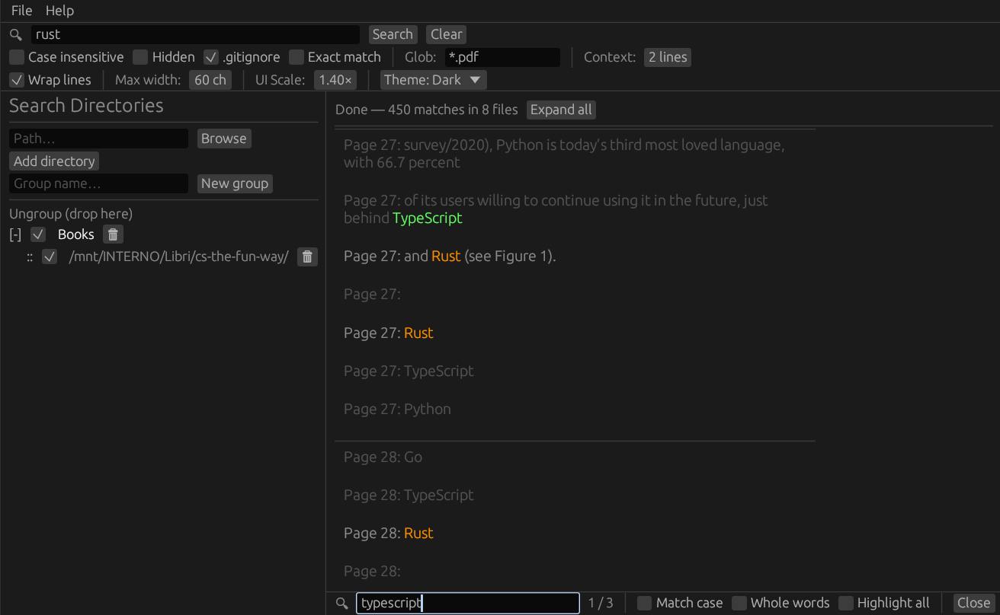

# rgathing
A graphical file content searcher, on top of rga

## Features
- All rga supported formats (PDFs, E-Books, Office documents, zip, tar.gz, etc)
- Multiple directories search
- Group directories by theme
- Case in/sensitive search
- Regex search
- Exclude patterns e.g. **/folder, *.epub
- Custom character width

## Screenshot

## Download
[Linux](https://github.com/plucafs/rgathing/releases/download/v0.1.0/rgathing-linux)

## Credits
[ripgrep-all](https://github.com/phiresky/ripgrep-all)
[pi](https://github.com/earendil-works/pi)
[OpenCode](https://github.com/anomalyco/opencode)

## License
MIT